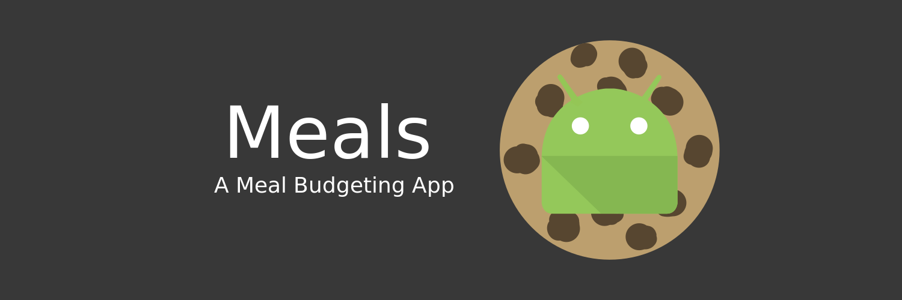

# Meals

  

**Android app for budgeting meals.**

Meals is a useful yet simple meal budgeting tool. After providing a starting
and current balance, and an end date for the budget period, Meals determine a
daily allowance. If you spend the recommended amount per day you will be able
to spend all of your budget. Also provided is an estimate for the remaining
fund this week and month, allowing you to easily purchase food for a longer
period without the worry of going over budget.

**Try it out on Android: https://goo.gl/q3lSCM**

